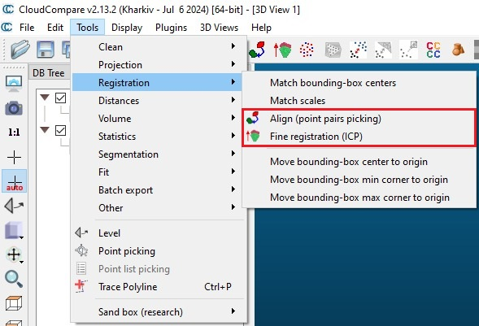
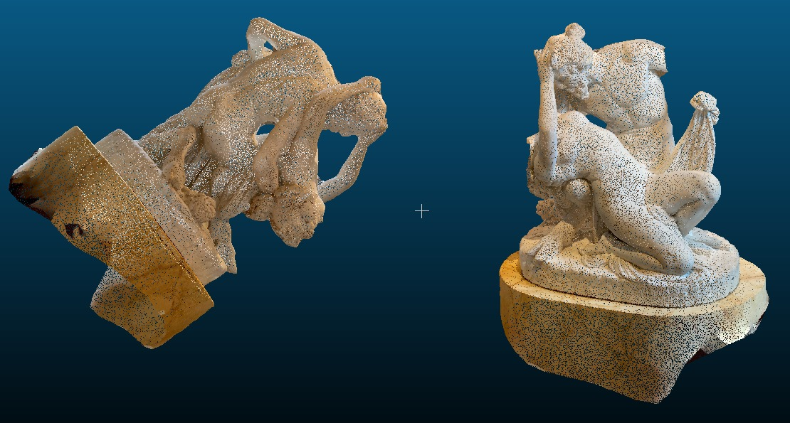
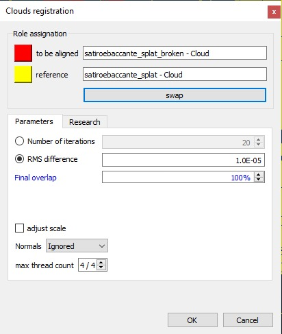
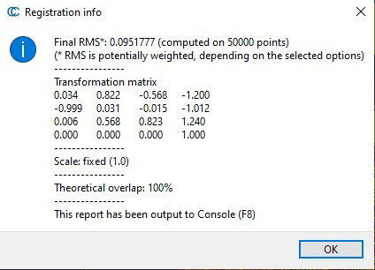
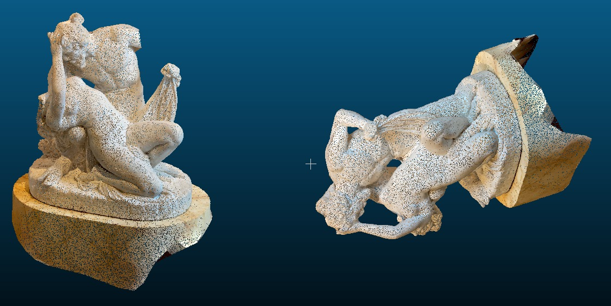
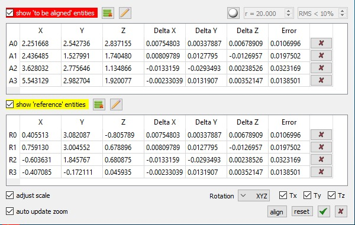
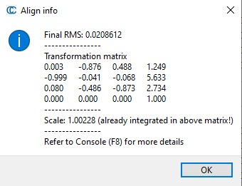
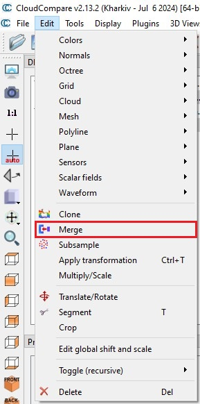
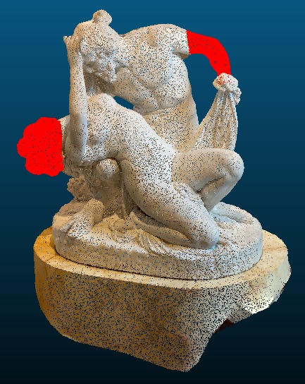

**Report on 3D Model Alignment and Merging Using CloudCompare**

**Introduction**

In order to develop our project and reach our goal we used **CloudCompare**, a 3D point cloud and mesh processing software widely used in fields such as engineering, archaeology, and computer vision. The software offers powerful tools for 3D data visualization, manipulation, alignment, and merging. In this project, we utilized CloudCompare to align and merge two models of a statue in **splat** **PLY format**. One model represented the complete statue, while the other simulated a broken version with missing parts.

**Objectives**

The primary objectives of this project were:

1. To explore two different alignment techniques available in CloudCompare: **Iterative Closest Point (ICP)** and **Point Pairs Picking**.
1. To understand the process of applying transformations and alignments to 3D models.
1. To perform a **merge operation** to combine aligned models into a single output model.

**Methodology**

**Loading the Models**

Initially we uploaded the two models into CloudCompare:

- A full model of the statue;
- A broken version of the same statue, simulating damage by removing certain sections of the geometry.

The models were in **splat PLY format**, which is commonly used for storing point clouds and 3D geometries.

**Initial Transformations**

Before aligning the models, we applied **rotations** and **translations** to one of them to simulate misalignment. This step ensured that the alignment process would be necessary and meaningful.

**Alignment Techniques**

Two alignment methods were tested:

**1. Iterative Closest Point (ICP)**

The **ICP algorithm** is a standard technique for aligning two 3D models by iteratively minimizing the distance between corresponding points. The steps followed were:

1. Selecting one model as the **reference** and the other as the **target** for alignment.
1. Setting the **theoretical overlap percentage**, which estimates the amount of overlap between the models.
1. Running the algorithm to compute the alignment.
1. CloudCompare generated a **transformation matrix** as the output of the alignment process, detailing the applied rotations and translations.

**2. Point Pairs Picking**

The **Point Pairs Picking** method requires manual selection of corresponding points on the two models. The steps followed were:

1. Selecting at least four pairs of matching points on the reference and target models.
1. Using these points to perform the alignment.
1. The software computed a **transformation matrix** based on the selected points, enabling the alignment.

**Model Merging**

After completing the alignments, we utilized CloudCompare's **merge tool** to combine the aligned models into a single output model. This operation ensured the creation of a unified geometry, which could then be exported for further use or analysis.

**Results**

As result of the project using CloudCompare we created a single point cloud, through merging, where the points corresponding to the missing parts of the broken statue are red colored in order to highlight the differences between the two models.

**Notes**

During the experiments we observed that there were some imprecisions by the software, mainly on the alignment methods. For what concern the ICP alignment we noted that not always the alignment is correctly done, it happens that sometimes necessary rotations are not properly applied if the target model is too much rotated than the reference one, while the transposition works well. On the other hand, the Point Pairs Picking method performs better in general than ICP, because the alignment is more precise but since the points have to be selected manually inevitably there isn’t an absolute precision.

